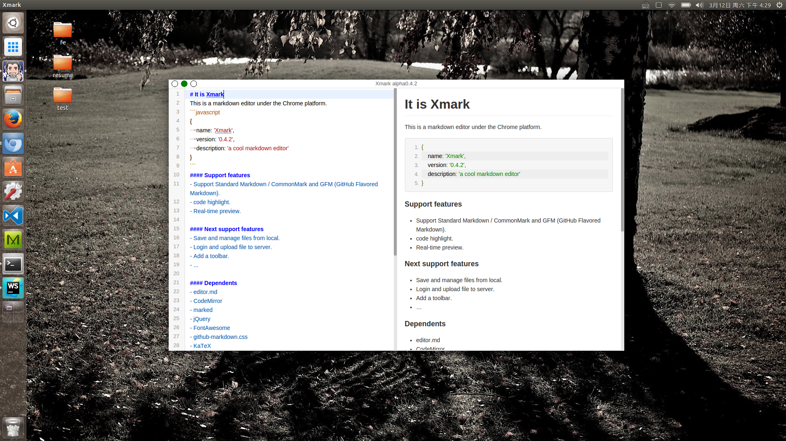

# It is Xmark
This is a markdown editor under the Chrome platform.



```javascript
{
	name: 'Xmark',
	version: 'alpha0.4.2',
	description: 'a cool markdown editor'
}
```
#### Support features
- Support Standard Markdown / CommonMark and GFM (GitHub Flavored Markdown).
- code highlight.
- Real-time preview.

#### Next support features
- Save and manage files from local.
- Login and upload file to server.
- Add a toolbar.
- ...

#### Dependents
- editor.md
- CodeMirror
- marked
- jQuery
- FontAwesome
- github-markdown.css
- KaTeX
- prettify.js
- Rephael.js
- flowchart.js
- sequence-diagram.js
- Prefixes.scss

#### GitHub repository
https://github.com/ChromeExt/xmark.git
welcome to star and fork!

---

# Updates
- 0.4.2(alpha)
  - 增加文档保存/恢复功能，新增快捷键`Ctrl + S`可快捷保存当前编辑的文档。存储区域为`chrome.storage`（未加密的存储块）。保存后的文档下次启动App时将会自动加载之前的内容。
  - Fixd bugs。
